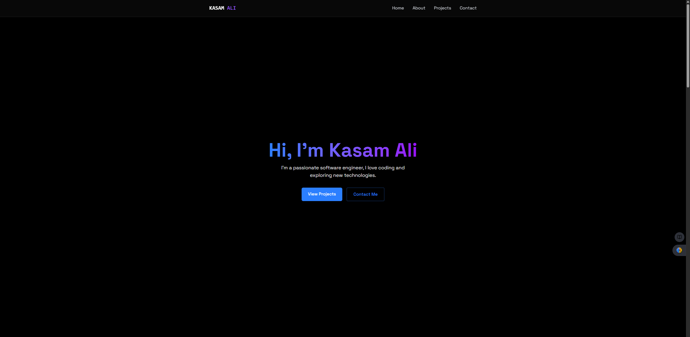
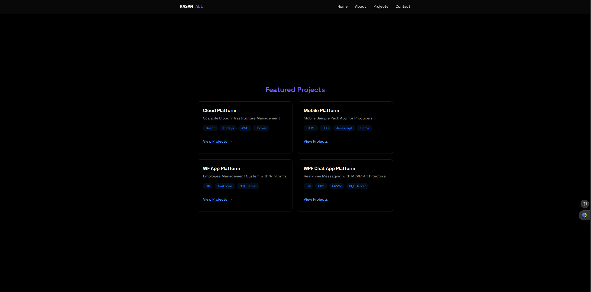

# 💼 VERIDIITE Portfolio – React + Vite

Welcome to my minimalist portfolio built using **React.js** and **Vite**. This is a clean, fast, and responsive front-end project that showcases my work, personal brand, and contact information.

> 🔗 **Live Website:** [https://veridiite.github.io/kasam-portfolio/](https://veridiite.github.io/kasam-portfolio/)

---

## 📸 Preview

 

 <!-- Optional: Add your own image if available -->

---

## 🛠 Tech Stack

- **React.js** – Front-end UI library
- **Vite** – Lightning-fast build tool with Hot Module Replacement
- **JavaScript (ES6+)**
- **CSS / Tailwind CSS** – (if used)
- **ESLint** – For linting and code quality
- **GitHub Pages** – For deployment

---

## 🧩 Plugins

This project supports two official Vite React plugins:

- [`@vitejs/plugin-react`](https://github.com/vitejs/vite-plugin-react) – Uses **Babel** for Fast Refresh
- [`@vitejs/plugin-react-swc`](https://github.com/vitejs/vite-plugin-react-swc) – Uses **SWC**, a faster alternative

---
